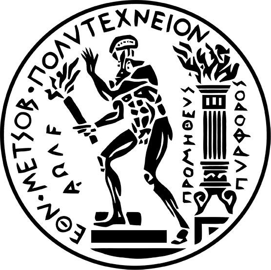
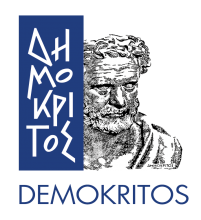



<table>
  <tr>
    <th colspan=2> Education </th>
  </tr>
  <tr>
    <td></td>
    <td><b>National Technical University of Athens</b>  
      <i>B.Sc - M.Eng</i> in <i>Electrical & Computer Engineering</i>  
      2015 - 2021   
      <i>Major</i>: Computer Science  
      <i>GPA</i>: 8.11 / 10.00  
      <i>Thesis</i>: "Focused Crawling on ethnopharmacological topics with Active and Reinforcement Learning"  
      <i>Advisors</i>: <a href="https://users.iit.demokritos.gr/~ggianna/" target="_blank">Dr. George Giannakopoulos</a>, <a             href="https://slp.cs.ece.ntua.gr/potam/index.html" target="_blank">Prof. Alexandros Potamianos</a>
    </td>
  </tr>
</table>

<table>
  <tr>
    <th colspan=2> Research Experience </th>
  </tr>
  <tr>
    <td></td>
    <td><b>University of Pireaus"</b>, Artificial Intelligence Laboratory, Greece  
      Jun 2021 - Present: <i><b>Research Assistant</b></i>  
      <i><u>Duties</u></i>: Research on Explainable Reinforcement Learning  
    </td>
  </tr>
    <tr>
    <td></td>
    <td><b>National Center for Scientific Research "Demokritos"</b>, Institute of Informatics & Telecommunications, Greece  
      Mar 2020 - Feb 2021: <i><b>Undergraduate Research Assistant</b></i>  
      <i><u>Duties</u></i>: Research on Focused Crawling tasks with Reinforcement Learning  
    </td>
  </tr>
</table>

<table>
  <tr><th> Talks and Presentations </th></tr>
   
    <tr><td></td></tr>
  
</table>

Skills
------
* Programming Languages: Python, Java, Prolog, C/C++, SML, SQL
* Machine Learning: Tensorflow 2.x, Keras, Sklearn, PyTorch

Languages
------
🇬🇷 Greek (Native), 🇬🇧 🇺🇸 English (C2), 🇩🇪 German (B1)

Hobbies
-------
Football ⚽, Basketball 🏀, AI Books 🚀, Movies 🎥
