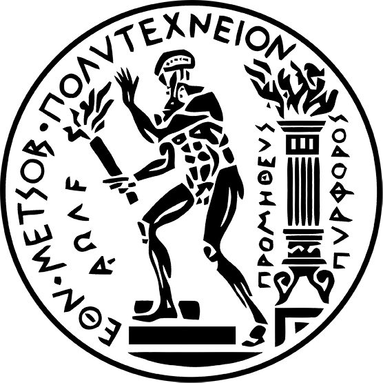



Education
------
<table>
  <tr>
    <td></td>
    <td><b>National Technical University of Athens</b>  
      <i>M.Sc.</i> in <i>Data Science and Machine Learning</i>  
      2021 - Present   
    </td>
  </tr>
  <tr>
    <td></td>
    <td><b>National Technical University of Athens</b>  
      <i>B.Sc - M.Eng.</i> in <i>Electrical & Computer Engineering</i>  
      2015 - 2021   
      <i>Major</i>: Computer Science  
      <i>GPA</i>: 8.11 / 10.00  
      <i>Thesis</i>: "Focused Crawling on ethnopharmacological topics with Active and Reinforcement Learning"  
      <i>Advisors</i>: <a href="https://users.iit.demokritos.gr/~ggianna/" target="_blank">Dr. George Giannakopoulos</a>, <a             href="https://slp.cs.ece.ntua.gr/potam/index.html" target="_blank">Prof. Alexandros Potamianos</a>
    </td>
  </tr>
</table>

Research Experience
------
<table>
  <tr>
    <td></td>
    <td><b>University of Pireaus</b>, Artificial Intelligence Laboratory, Greece  
      Jun 2021 - Present: <i><b>Research Assistant</b></i>  
      <i><u>Research topics</u></i>: Explainable Reinforcement Learning (XRL)  
      - Working on <a href="http://datacron1.ds.unipi.gr:9083/ai-lab/projects/tapas-towards-an-automated-and-explainable-atm-system/" target="_blank">TAPAS</a> project  
      - Supervised by <a href="https://scholar.google.com/citations?hl=en&user=PBX9aQUAAAAJ" target="_blank">Prof. George Vouros</a>
    </td>
  </tr>
    <tr>
    <td></td>
    <td><b>National Center for Scientific Research "Demokritos"</b>, Software and Knowledge Engineering Lab, Greece  
      Mar 2020 - Feb 2021: <i><b>Undergraduate Research Assistant</b></i>  
      <i><u>Research topics</u></i>: Focused Crawling tasks with Reinforcement Learning (RL)  
      - Supervised by <a href="https://users.iit.demokritos.gr/~ggianna/" target="_blank">Dr. George Giannakopoulos</a>
    </td>
  </tr>
</table>

Teaching Experience
------
<table>
  <tr>
    <td></td>
    <td><b>National Technical University of Athens</b>, School of ECE, Greece  
      Oct 2016 - Feb 2019: <i><b>Undergraduate Teaching Assistant</b></i>  
      <i><u>Courses</u></i>: 
      <a href="https://www.ece.ntua.gr/en/undergraduate/courses/3020" target="_blank">Computer Programming</a> (3.4.3020.1), 
      <a href="https://www.ece.ntua.gr/en/undergraduate/courses/3138" target="_blank">Programming Techniques</a> (3.4.3138.2)
    </td>
  </tr>
</table>

Skills
------
* Programming Languages: Python, Java, Prolog, C/C++, SML, SQL
* Machine Learning: Tensorflow, Keras, Sklearn

Languages
------
🇬🇷 Greek (Native), 🇬🇧 🇺🇸 English (C2), 🇩🇪 German (B1)

Hobbies
-------
Football ⚽, Basketball 🏀, AI Books 🚀, Movies 🎥
